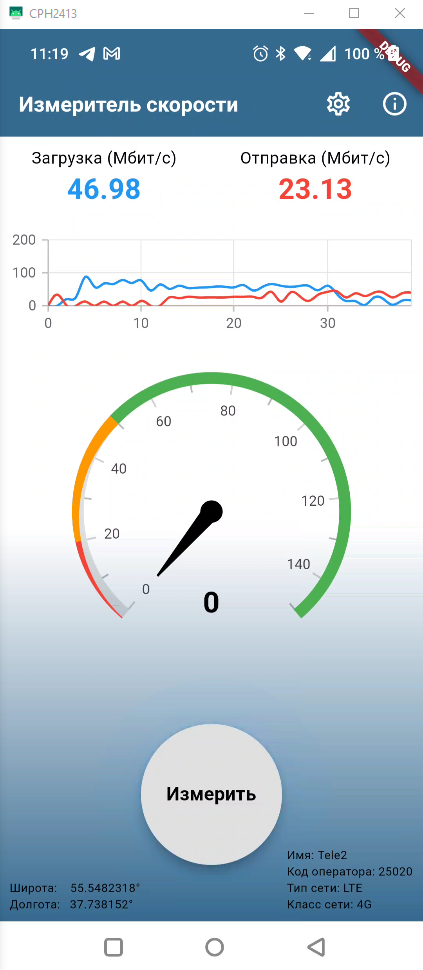

# GSM network speed meter

## Application for measuring the speed of GSM network operators when transmitting HTTP traffic.

The main difference in the work of this application from https://www.speedtest.net/:
 - work exclusively via HTTP protocol;
 - metering with the specified node in the network, not with the nearest node.

These differences allow to measure real speed of traffic which is exchanged by 99% of applications (HTTP) and exclude measure inside provider's local network.

